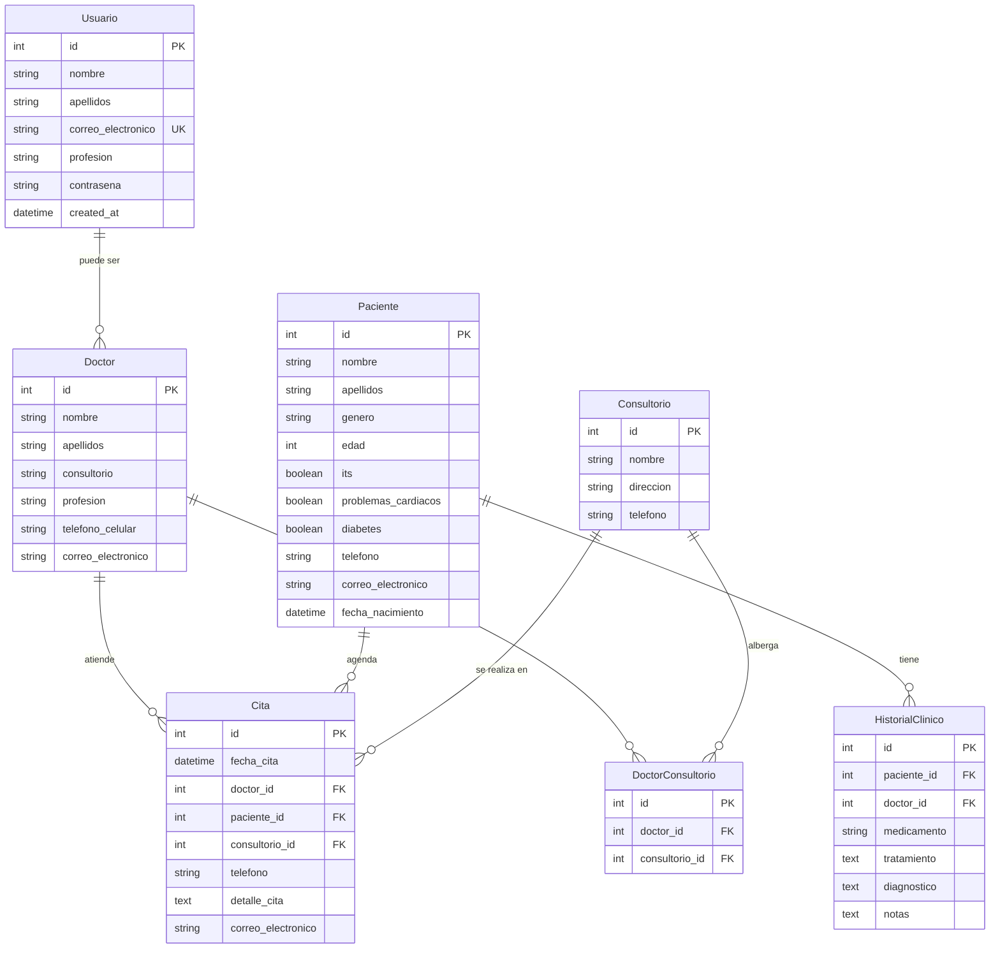
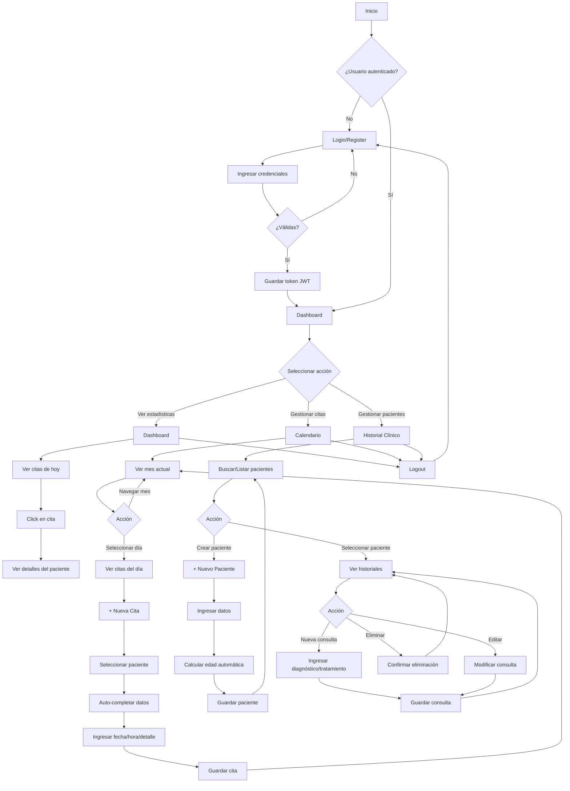

---

## 📌 Resumen Ejecutivo

El **Sistema de Gestión Clínica Dental** es una aplicación web completa diseñada para optimizar la administración de consultorios odontológicos. El sistema permite el registro y autenticación de usuarios (doctores), gestión integral de pacientes, programación de citas mediante un calendario interactivo, y mantenimiento de historiales clínicos detallados.

**Estado actual:** Todas las funcionalidades principales han sido implementadas y probadas exitosamente en entorno de desarrollo local. El sistema está listo para pruebas de usuario y despliegue en ambiente de producción.

**Recomendaciones:** Implementar pruebas automáticas (unitarias e integración), configurar CI/CD, y establecer procedimientos de respaldo de base de datos antes del despliegue en producción.

---

## 🎯 Alcance y Requisitos

### Requisitos Funcionales Implementados ✅

| ID | Requisito | Estado | Descripción |
|----|-----------|--------|-------------|
| RF-01 | Registro de usuarios | ✅ Completo | Registro de doctores con validación de datos |
| RF-02 | Autenticación segura | ✅ Completo | Login con JWT y gestión de sesiones |
| RF-03 | Gestión de pacientes | ✅ Completo | CRUD completo de pacientes con búsqueda |
| RF-04 | Historial clínico | ✅ Completo | Registro de consultas médicas por paciente |
| RF-05 | Calendario de citas | ✅ Completo | Vista mensual con gestión de citas |
| RF-06 | Dashboard informativo | ✅ Completo | Resumen con estadísticas y agenda del día |
| RF-07 | Cálculo automático de edad | ✅ Completo | Desde fecha de nacimiento del paciente |
| RF-08 | Auto-completado de datos | ✅ Completo | Teléfono y correo al seleccionar paciente |
| RF-09 | Búsqueda de pacientes | ✅ Completo | Filtrado en tiempo real por nombre |
| RF-10 | Registro de condiciones médicas | ✅ Completo | Diabetes, problemas cardíacos, ITS |

### Requisitos No Funcionales

| Categoría | Implementación |
|-----------|----------------|
| **Seguridad** | ✅ Hashing de contraseñas (bcrypt), JWT para autenticación, validación de esquemas con Pydantic |
| **Usabilidad** | ✅ Interfaz intuitiva con Tailwind CSS, navegación clara, feedback visual |
| **Rendimiento** | ✅ Respuestas rápidas en local, paginación no requerida para datasets actuales |
| **Escalabilidad** | ⚠️ Arquitectura preparada, requiere optimización de queries para producción |
| **Mantenibilidad** | ✅ Código modular, separación backend/frontend, documentación inline |

---

## 🏗️ Arquitectura General

### Diagrama de Alto Nivel

```
┌─────────────────────────────────────────────────────────────┐
│                        FRONTEND                              │
│  React + Vite + Tailwind CSS + React Router                 │
│                                                              │
│  ┌──────────┐  ┌──────────┐  ┌──────────┐  ┌──────────┐   │
│  │  Login   │  │Dashboard │  │Calendario│  │Historial │   │
│  │ Register │  │          │  │          │  │ Clínico  │   │
│  └──────────┘  └──────────┘  └──────────┘  └──────────┘   │
│                                                              │
│                    HTTP + JSON (REST API)                    │
│                    JWT Authentication                        │
└──────────────────────────┬───────────────────────────────────┘
                           │
                           ▼
┌─────────────────────────────────────────────────────────────┐
│                        BACKEND                               │
│              FastAPI + SQLAlchemy + Pydantic                 │
│                                                              │
│  ┌──────────────────────────────────────────────────────┐  │
│  │              API REST Endpoints                       │  │
│  │  /register, /login, /pacientes, /historiales, /citas │  │
│  └──────────────────────────────────────────────────────┘  │
│                                                              │
│  ┌──────────────────────────────────────────────────────┐  │
│  │            Business Logic (CRUD)                      │  │
│  │   crud.py - Operaciones de base de datos             │  │
│  └──────────────────────────────────────────────────────┘  │
│                                                              │
│  ┌──────────────────────────────────────────────────────┐  │
│  │           Data Models (SQLAlchemy ORM)                │  │
│  │   models.py - Definición de tablas                   │  │
│  └──────────────────────────────────────────────────────┘  │
└──────────────────────────┬───────────────────────────────────┘
                           │
                           ▼
┌─────────────────────────────────────────────────────────────┐
│                    BASE DE DATOS                             │
│                      MySQL 8.0+                              │
│                                                              │
│  Tablas: usuario, doctor, paciente, historial_clinico,      │
│          cita, consultorio, doctor_consultorio               │
└─────────────────────────────────────────────────────────────┘
```

### Stack Tecnológico

| Capa | Tecnología | Versión | Propósito |
|------|------------|---------|-----------|
| **Frontend** | React | 18.x | Librería UI |
| | Vite | 5.x | Build tool y dev server |
| | React Router | 6.x | Navegación SPA |
| | Tailwind CSS | 3.x | Estilos y diseño responsive |
| | date-fns | 3.x | Manejo de fechas |
| **Backend** | FastAPI | 0.100+ | Framework web |
| | Python | 3.10+ | Lenguaje |
| | SQLAlchemy | 2.x | ORM |
| | Pydantic | 2.x | Validación de datos |
| | Passlib | 1.7+ | Hashing de contraseñas |
| | PyJWT | 2.x | JSON Web Tokens |
| | python-multipart | 0.0.6+ | Manejo de formularios |
| **Base de Datos** | MySQL | 8.0+ | RDBMS |
| | MySQLdb | 2.x | Driver de conexión |

---

## 💾 Modelo de Datos

### Entidades Principales



### Descripción de Tablas

#### Usuario
- **Propósito:** Almacenar credenciales y datos básicos de usuarios del sistema (doctores)
- **Campos clave:** `correo_electronico` (único), `contrasena` (hasheada con bcrypt)
- **Relaciones:** Puede asociarse a un Doctor si la profesión ≠ "paciente"

#### Paciente
- **Propósito:** Registro de pacientes del consultorio
- **Campos clave:** `edad` (calculada automáticamente), condiciones médicas (boolean flags)
- **Validaciones:** Fecha de nacimiento requerida para cálculo de edad

#### HistorialClinico
- **Propósito:** Registro de consultas médicas por paciente
- **Campos clave:** `diagnostico`, `tratamiento`, `medicamento`, `notas`
- **Relaciones:** N:1 con Paciente, N:1 opcional con Doctor

#### Cita
- **Propósito:** Gestión de agenda de citas
- **Campos clave:** `fecha_cita` (datetime), `detalle_cita` (motivo)
- **Relaciones:** N:1 con Paciente, N:1 opcional con Doctor y Consultorio

---

## 🔌 API REST y Contrato

### Autenticación

Todos los endpoints (excepto `/register` y `/login`) requieren autenticación JWT.

**Header requerido:**
```
Authorization: Bearer <token>
```

**Obtener token:**
```http
POST /login
Content-Type: application/x-www-form-urlencoded

username=doctor@ejemplo.com&password=mipassword
```

**Response:**
```json
{
  "access_token": "eyJhbGciOiJIUzI1NiIsInR5cCI6IkpXVCJ9...",
  "token_type": "bearer",
  "user": {
    "id": 1,
    "nombre": "Juan",
    "apellidos": "Pérez",
    "correo_electronico": "doctor@ejemplo.com"
  }
}
```

### Endpoints Principales

#### Autenticación

| Método | Endpoint | Descripción | Auth |
|--------|----------|-------------|------|
| POST | `/register` | Registrar nuevo usuario | No |
| POST | `/login` | Autenticarse y obtener token | No |
| POST | `/logout` | Cerrar sesión (frontend limpia token) | Sí |

#### Pacientes

| Método | Endpoint | Descripción | Request Body |
|--------|----------|-------------|--------------|
| GET | `/pacientes` | Listar todos los pacientes | - |
| GET | `/pacientes/{id}` | Obtener paciente específico | - |
| POST | `/pacientes` | Crear nuevo paciente | PacienteCreate |
| PUT | `/pacientes/{id}` | Actualizar paciente | PacienteCreate |
| DELETE | `/pacientes/{id}` | Eliminar paciente | - |

**Ejemplo Request (POST /pacientes):**
```json
{
  "nombre": "Juan Carlos",
  "apellidos": "Rodríguez Martínez",
  "genero": "M",
  "edad": 38,
  "its": false,
  "problemas_cardíacos": false,
  "diabetes": true,
  "telefono": "81-1234-5678",
  "correo_electronico": "juan.rodriguez@email.com",
  "fecha_nacimiento": "1985-03-15T00:00:00"
}
```

#### Historial Clínico

| Método | Endpoint | Descripción | Request Body |
|--------|----------|-------------|--------------|
| GET | `/historiales` | Listar todos los historiales | - |
| GET | `/historiales/{id}` | Obtener historial específico | - |
| GET | `/historiales/paciente/{id}` | Obtener historiales de un paciente | - |
| POST | `/historiales` | Crear nueva consulta | HistorialClinicoCreate |
| PUT | `/historiales/{id}` | Actualizar consulta | HistorialClinicoUpdate |
| DELETE | `/historiales/{id}` | Eliminar consulta | - |

**Ejemplo Request (POST /historiales):**
```json
{
  "paciente_id": 1,
  "doctor_id": 1,
  "diagnostico": "Caries dental en segundo molar superior derecho",
  "tratamiento": "Obturación con resina fotopolimerizable",
  "medicamento": "Ibuprofeno 400mg cada 8 horas por 3 días",
  "notas": "Control en 2 semanas para verificar ajuste oclusal"
}
```

#### Citas

| Método | Endpoint | Descripción | Request Body |
|--------|----------|-------------|--------------|
| GET | `/citas` | Listar todas las citas | - |
| GET | `/citas/{id}` | Obtener cita específica | - |
| POST | `/citas` | Crear nueva cita | CitaCreate |
| PUT | `/citas/{id}` | Actualizar cita | CitaUpdate |
| DELETE | `/citas/{id}` | Eliminar cita | - |

**Ejemplo Request (POST /citas):**
```json
{
  "paciente_id": 1,
  "doctor_id": 1,
  "consultorio_id": null,
  "fecha_cita": "2025-11-09T10:00:00",
  "detalle_cita": "Limpieza dental",
  "telefono": "81-1234-5678",
  "correo_electronico": "juan.rodriguez@email.com"
}
```

#### Doctores y Consultorios

| Método | Endpoint | Descripción |
|--------|----------|-------------|
| GET | `/doctores` | Listar todos los doctores |
| GET | `/consultorios` | Listar todos los consultorios |

### OpenAPI Schema

Para obtener la especificación OpenAPI completa:
```bash
GET http://localhost:8000/openapi.json
```

O visitar la documentación interactiva:
```bash
http://localhost:8000/docs          # Swagger UI
http://localhost:8000/redoc         # ReDoc
```

---

## 🎨 Frontend - Componentes y Páginas

### Estructura de Componentes

```
src/
├── components/
│   ├── Login.jsx           - Autenticación de usuarios
│   ├── Register.jsx        - Registro de nuevos usuarios
│   ├── MainLayout.jsx      - Layout principal con navegación
│   ├── Dashboard.jsx       - Vista general y estadísticas
│   ├── Calendario.jsx      - Gestión de citas mensuales
│   └── HistorialClinico.jsx - Gestión de pacientes e historiales
├── App.jsx                 - Configuración de rutas
├── main.jsx               - Entry point
└── index.css              - Estilos globales (Tailwind)
```

### Flujo de Usuario Principal



### Características de Interfaz

#### Login/Register
- ✅ Validación en tiempo real
- ✅ Mensajes de error claros
- ✅ Redirección automática tras éxito
- ✅ Almacenamiento seguro de tokens en localStorage

#### Dashboard
- ✅ Tarjetas de estadísticas (total pacientes, citas hoy, citas semana)
- ✅ Lista de citas del día con horarios
- ✅ Panel lateral con detalles del paciente seleccionado
- ✅ Navegación rápida a calendario e historial

#### Calendario
- ✅ Vista mensual interactiva
- ✅ Días con citas resaltados en azul
- ✅ Panel lateral con agenda del día seleccionado
- ✅ Modal para crear cita con auto-completado
- ✅ Eliminación de citas con confirmación
- ✅ Estadísticas: total pacientes, consultas del mes, citas pendientes

#### Historial Clínico
- ✅ Búsqueda de pacientes en tiempo real
- ✅ Lista de pacientes con información básica
- ✅ Vista de historiales por paciente
- ✅ CRUD completo de consultas
- ✅ Cálculo automático de edad desde fecha de nacimiento
- ✅ Registro de condiciones médicas (diabetes, problemas cardíacos, ITS)

---

## 🔐 Seguridad

### Medidas Implementadas

| Aspecto | Implementación | Detalles |
|---------|----------------|----------|
| **Autenticación** | JWT (JSON Web Tokens) | Tokens firmados con HS256, expiración configurable |
| **Hashing de contraseñas** | Bcrypt (Passlib) | Factor de costo: 12 rounds |
| **Validación de datos** | Pydantic Schemas | Validación de tipos, emails, campos requeridos |
| **CORS** | FastAPI Middleware | Configurado para permitir origen del frontend |
| **SQL Injection** | SQLAlchemy ORM | Queries parametrizadas automáticamente |
| **Autorización** | Bearer Token | Header `Authorization: Bearer <token>` en todas las rutas protegidas |

### Flujo de Autenticación

```python
# 1. Usuario envía credenciales
POST /login
Body: { username: "email", password: "pass" }

# 2. Backend valida y genera token
- Buscar usuario por email
- Verificar contraseña hasheada con bcrypt
- Generar JWT con payload: { "sub": email, "exp": timestamp }
- Retornar token

# 3. Frontend guarda token
localStorage.setItem('token', token)

# 4. Frontend incluye token en requests
Headers: { Authorization: 'Bearer <token>' }

# 5. Backend valida token en cada request
- Decodificar JWT
- Verificar firma y expiración
- Obtener usuario desde payload
- Permitir o denegar acceso
```

### Validaciones de Esquemas (Pydantic)

```python
# Ejemplo: Validación de registro de usuario
class RegisterData(BaseModel):
    nombre: str
    apellidos: str
    correo_electronico: EmailStr  # Valida formato de email
    contrasena: str                # Min 6 caracteres en frontend

# Ejemplo: Validación de creación de paciente
class PacienteCreate(BaseModel):
    nombre: str
    apellidos: str
    genero: Optional[str] = None
    edad: Optional[int] = None
    its: bool = False
    problemas_cardíacos: bool = False
    diabetes: bool = False
    telefono: Optional[str] = None
    correo_electronico: Optional[str] = None
    fecha_nacimiento: Optional[datetime] = None
```

---

## 🧪 Pruebas

### Tipos de Pruebas Realizadas

#### Pruebas Manuales (Integración)

| Caso de Prueba | Estado | Notas |
|----------------|--------|-------|
| Registro de usuario nuevo | ✅ Exitoso | Validación de email único funcionando |
| Login con credenciales válidas | ✅ Exitoso | Token JWT generado correctamente |
| Login con credenciales inválidas | ✅ Exitoso | Error 401 con mensaje apropiado |
| Crear paciente con datos completos | ✅ Exitoso | Edad calculada automáticamente |
| Crear paciente con apellidos vacíos | ⚠️ Fallo | Resuelto: campo `apellidos` requerido |
| Búsqueda de pacientes en tiempo real | ✅ Exitoso | Filtrado funciona correctamente |
| Crear consulta médica | ✅ Exitoso | Relación paciente-historial funcionando |
| Crear cita sin `doctor_id` | ⚠️ Fallo | Resuelto: `doctor_id` opcional |
| Crear cita para día específico | ✅ Exitoso | Aparece en calendario correctamente |
| Dashboard muestra citas de hoy | ✅ Exitoso | Filtrado por fecha funciona |
| Eliminar paciente con historiales | ✅ Exitoso | Cascade delete funciona |
| Navegación entre componentes | ✅ Exitoso | React Router funciona correctamente |

#### Pruebas de Validación de Datos

| Campo | Validación | Estado |
|-------|------------|--------|
| Email | Formato válido (EmailStr) | ✅ |
| Contraseña | Mínimo 6 caracteres | ✅ |
| Fecha de nacimiento | Formato datetime | ✅ |
| Campos requeridos | Not null | ✅ |
| Foreign keys | Existencia de registros relacionados | ✅ |

### Errores Conocidos y Soluciones

| Error | Causa | Solución Aplicada |
|-------|-------|-------------------|
| `422 Unprocessable Entity` al crear cita | `consultorio_id` esperaba valor no-null | Hacer campo opcional en schema |
| `1048 Column 'apellidos' cannot be null` | Campo `apellidos` enviado como `None` | Forzar string vacío "" si es None |
| `500 Internal Server Error` al cargar paciente | Endpoint GET `/pacientes/{id}` no existía | Agregar endpoint en routes.py |
| Citas no aparecen en Dashboard | Filtro de fecha comparaba strings vs datetime | Normalizar a formato ISO date |

---

### Instalación y Ejecución

#### Backend

```bash
# 1. Navegar a carpeta backend
cd backend

# 2. Crear entorno virtual (recomendado)
python -m venv venv

# Windows
venv\Scripts\activate

# Linux/Mac
source venv/bin/activate

# 3. Instalar dependencias
pip install -r requirements.txt

# requirements.txt debe contener:
# fastapi>=0.100.0
# uvicorn[standard]>=0.23.0
# sqlalchemy>=2.0.0
# pymysql>=1.1.0
# mysqlclient>=2.2.0
# pydantic[email]>=2.0.0
# python-jose[cryptography]>=3.3.0
# passlib[bcrypt]>=1.7.4
# python-multipart>=0.0.6
# python-dotenv>=1.0.0

# 4. Crear base de datos en MySQL
mysql -u root -p
CREATE DATABASE nombre_bd CHARACTER SET utf8mb4 COLLATE utf8mb4_unicode_ci;
EXIT;

# 5. Las tablas se crean automáticamente al iniciar (si usas create_all en database.py)
# O ejecutar migraciones si las tienes

# 6. Ejecutar servidor
uvicorn main:app --reload --host 0.0.0.0 --port 8000

# Servidor disponible en: http://localhost:8000
# Documentación: http://localhost:8000/docs
```

#### Frontend

```bash
# 1. Navegar a carpeta frontend
cd frontend

# 2. Instalar dependencias
npm install

# package.json debe incluir:
# react, react-dom, react-router-dom, date-fns, tailwindcss, vite, etc.

# 3. Configurar URL del backend (si es necesaria)
# Editar API_URL en los componentes si el backend no está en localhost:8000

# 4. Ejecutar servidor de desarrollo
npm run dev

# 5. Abrir en navegador
# http://localhost:5173
```

### Build para Producción

#### Backend
```bash
# Opción 1: Uvicorn con Gunicorn (recomendado)
pip install gunicorn
gunicorn main:app --workers 4 --worker-class uvicorn.workers.UvicornWorker --bind 0.0.0.0:8000

# Opción 2: Docker
# Crear Dockerfile en carpeta backend/
docker build -t clinica-backend .
docker run -p 8000:8000 clinica-backend
```

#### Frontend
```bash
# Build de producción
npm run build

# Genera carpeta dist/ con archivos estáticos
# Servir con nginx, apache, o servicio de hosting estático

# Ejemplo con servidor simple:
npm install -g serve
serve -s dist -l 3000
```

### Arquitectura de Despliegue Recomendada

```
                    Internet
                       │
                       ▼
                 Load Balancer
                       │
        ┌──────────────┴──────────────┐
        ▼                             ▼
   Frontend (CDN)            Backend (Gunicorn)
   Archivos estáticos        FastAPI + Uvicorn
   (React build)             Puerto 8000
        │                             │
        └─────────────┬───────────────┘
                      ▼
                 MySQL Database
                 Puerto 3306
```

---

## 📊 Observabilidad y Monitoreo

### Logs

#### Backend (FastAPI)
```python
# Logs en stdout (uvicorn)
INFO:     127.0.0.1:52901 - "POST /login HTTP/1.1" 200 OK
INFO:     127.0.0.1:52902 - "GET /pacientes HTTP/1.1" 200 OK
ERROR:    Exception in ASGI application (detalles del error)
```

**Recomendación:** Implementar logging estructurado con python-logging y rotar archivos de log.

#### Frontend (Console)
```javascript
// Logs de desarrollo en consola del navegador
console.log('🔍 Cargando paciente ID:', pacienteId)
console.log('📤 Payload a enviar:', payload)
console.error('❌ Error del servidor:', errorData)
```

**Recomendación:** Configurar herramienta de monitoreo como Sentry para producción.

### Errores Comunes y Troubleshooting

| Error | Síntoma | Causa Probable | Solución |
|-------|---------|----------------|----------|
| `CORS policy` | Requests bloqueados desde frontend | CORS no configurado | Agregar origen del frontend en CORSMiddleware |
| `401 Unauthorized` | Redirección a login | Token expirado o inválido | Renovar token o re-autenticarse |
| `422 Unprocessable Entity` | Request rechazado | Datos no coinciden con schema | Verificar estructura del JSON enviado |
| `500 Internal Server Error` | Error genérico | Excepción no capturada en backend | Revisar logs del servidor |
| `Connection refused` | Frontend no puede conectar | Backend no está ejecutándose | Iniciar servidor backend |
| `404 Not Found` | Endpoint no existe | Ruta incorrecta o endpoint no implementado | Verificar URL y routes.py |

### Monitoreo de Salud

**Endpoint de Health Check (recomendado agregar):**
```python
@app.get("/health")
def health_check():
    return {"status": "ok", "timestamp": datetime.now().isoformat()}
```

---

## ⚠️ Limitaciones y Trabajo Futuro

### Limitaciones Actuales

| Área | Limitación | Impacto |
|------|------------|---------|
| **Pruebas** | Sin pruebas automáticas | Riesgo de regresiones en cambios |
| **Escalabilidad** | Queries sin paginación | Rendimiento degradado con >1000 registros |
| **Roles** | No hay diferenciación de permisos | Todos los usuarios tienen acceso completo |
| **Notificaciones** | Sin recordatorios de citas | Pacientes no reciben confirmaciones |
| **Reportes** | Sin generación de reportes | No hay análisis histórico automatizado |
| **Multi-consultorio** | Un solo consultorio asumido | No soporta cadenas de consultorios |
| **Auditoría** | Sin registro de cambios | No hay trazabilidad de modificaciones |

### Roadmap de Mejoras

#### Corto Plazo (1-2 meses)
- [ ] Implementar pruebas unitarias (pytest + Jest)
- [ ] Agregar paginación en listados de pacientes/citas
- [ ] Implementar roles (Admin, Doctor, Recepcionista)
- [ ] Agregar validación de horarios (evitar citas duplicadas)
- [ ] Implementar búsqueda avanzada con filtros

#### Mediano Plazo (3-6 meses)
- [ ] Sistema de notificaciones por email/SMS
- [ ] Generación de reportes PDF (historial clínico, recetas)
- [ ] Dashboard con gráficas de estadísticas
- [ ] Módulo de facturación
- [ ] Historial de cambios (auditoría)
- [ ] Respaldo automático configurado

#### Largo Plazo (6-12 meses)
- [ ] Aplicación móvil (React Native)
- [ ] Portal para pacientes (ver citas, historial)
- [ ] Integración con servicios de pago
- [ ] Soporte multi-consultorio
- [ ] Inteligencia artificial para sugerencias de diagnóstico
- [ ] Integración con sistemas de seguros médicos

---

## 📎 Anexos

### Anexo A: Estructura de Carpetas del Proyecto

```
Proyecto/
├── backend/
│   ├── app/
│   │   ├── __init__.py
│   │   ├── crud.py              # Operaciones CRUD
│   │   ├── database.py          # Configuración de BD
│   │   ├── models.py            # Modelos SQLAlchemy
│   │   ├── routes.py            # Endpoints REST
│   │   ├── schemas.py           # Esquemas Pydantic
│   │   └── utils.py             # Utilidades (JWT, hashing)
│   ├── main.py                  # Entry point FastAPI
│   ├── requirements.txt         # Dependencias Python
│   └── .env                     # Variables de entorno
│
├── frontend/
│   ├── src/
│   │   ├── components/
│   │   │   ├── Login.jsx
│   │   │   ├── Register.jsx
│   │   │   ├── MainLayout.jsx
│   │   │   ├── Dashboard.jsx
│   │   │   ├── Calendario.jsx
│   │   │   └── HistorialClinico.jsx
│   │   ├── App.jsx
│   │   ├── main.jsx
│   │   └── index.css
│   ├── public/
│   ├── index.html
│   ├── package.json
│   ├── vite.config.js
│   └── tailwind.config.js
│
├── docs/                        # Documentación (agregar)
│   ├── openapi.json
│   ├── diagrams/
│   │   ├── uml_classes.puml
│   │   ├── uml_activities.puml
│   │   └── flows.mmd
│   └── screenshots/
│
└── README.md                    # Este documento
```

### Anexo D: Capturas de Pantalla

**Recomendación:** Agregar las siguientes capturas:

1. `login_screen.png` - Pantalla de inicio de sesión
2. `dashboard.png` - Vista del dashboard con estadísticas
3. `calendario.png` - Calendario con citas del mes
4. `historial_clinico.png` - Lista de pacientes y consultas
5. `crear_cita.png` - Modal de creación de cita
6. `crear_paciente.png` - Modal de registro de paciente
7. `api_docs.png` - Documentación Swagger UI

---

## 📝 Conclusiones

El Sistema de Gestión Clínica Dental ha sido implementado exitosamente con todas las funcionalidades principales operativas. El sistema proporciona una solución completa para la administración de consultorios odontológicos, desde la gestión de pacientes hasta la programación de citas y mantenimiento de historiales clínicos.

### Logros Principales
✅ Arquitectura moderna y escalable (FastAPI + React)  
✅ Autenticación segura con JWT  
✅ CRUD completo para todas las entidades principales  
✅ Interfaz de usuario intuitiva y responsive  
✅ Integración completa entre frontend y backend  
✅ Validación robusta de datos  

### Próximos Pasos
1. Implementar pruebas automáticas
2. Configurar pipeline de CI/CD
3. Establecer procedimientos de backup
4. Agregar sistema de roles y permisos
5. Implementar notificaciones por email

**Estado del proyecto:** ✅ **Listo para pruebas de usuario y preparación para producción**
